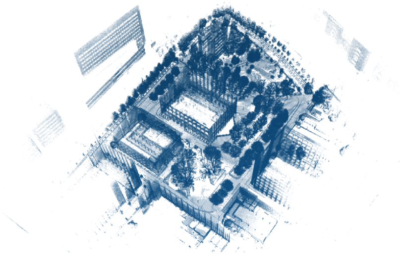

<!-- footer: 2026年上田研の研究紹介 -->

# 千葉工大自律ロボット研究室（上田研究室）

千葉工業大学 上田 隆一

This work is licensed under a <a rel="license" href="http://creativecommons.org/licenses/by-sa/4.0/">Creative Commons Attribution-ShareAlike 4.0 International License</a>.

---

<!-- paginate: true -->

## 内容

- マニピュレータの研究
- 移動ロボットの研究
- 宇宙関連

---

## マニピュレータの研究

---

### リアルなCGを用いた植物の茎と葉の識別

- CGをつかって人工ニューラルネットワークを学習
- 畑の密集した作物から葉と茎の画素を検出
- 葉に隠れた茎を推定し、木の構造を再構築
- [論文](https://www.rsj.or.jp/pub/jrsj/advpub/400201.html)（日本ロボット学会誌論文賞）
    - [論文に掲載した図](https://github.com/ryuichiueda/jrsj_color_figs/tree/main/vol_40_no_2)

---

### 畑のシミュレーション

- 前ページのCGをさらに発展させて、畑のシミュレータを作り、そこから学習データを得る
- 枝の生え方、葉のつきかたのバリエーションを出す
- 文献
    - Zander Polson, Yasuo Hayashibara, Ryuichi Ueda: Pipeline for Scalable Synthetic Crop Generation using L-systems, Toward Structurally Grounded Synthetic Data for Agricultural Robotics, 日本機械学会ロボティクス・メカトロニクス講演会2026講演論文集, 1A1-K04, 2026.

---

### 混合ガウス分布の変分推論を用いた物体の把持位置検出

- 2指のロボットハンドで持ちやすい箇所を物体の表面から探す研究
- 手法
    - 持つことが可能な箇所の分布に混合ガウス分布を当てはめてクラスタリング
    - 一番大きいクラスタからある基準で最良な箇所を選んで掴む
- 論文（掲載待ち）
    - 下鳥他: 2指ハンドとハンドアイカメラを持つ多自由度マニピュレータのための3次元点群からの把持位置検出, 日本ロボット学会誌, Vol. 43, 2026(?)
    - [動画](https://github.com/ryuichiueda/jrsj_color_figs/tree/main/vol_43_xx)

---

### 透明な小袋の検出

- 身の回りにあるもので最も画像から検出することが難しもののひとつ
- これもCGで人工ニューラルネットワークを学習
- 文献
    - 石原 新也, 山田 啓太, 加藤 みのり, 姜 平, 大賀 淳一郎, 菅原 淳, 上田 隆一: ハンドアイ RGB カメラを有するマニピュレータのための透明な小袋の認識, 2P2-D22, 日本機械学会ロボティクス・メカトロニクス講演会2023講演論文集, 2P1-G07, 2023.

---

## 移動ロボットの研究

---

### 価値反復による行動計画

- 環境の全地点、ロボットの向きからのゴールまでの所要時間・その他コストを計算し続ける
    - 進路変更をスムーズにできる
    - 移動物体に進路を阻まれても大きく迂回できる
- 文献
    - [[Ueda+ 2023]](https://www.fujipress.jp/jrm/rb/robot003500061489/)
- [動画1](https://www.youtube.com/watch?v=9a1O16LMtdg)（大きな袋小路の回避）
- [動画2](https://www.youtube.com/watch?v=n7LXx50gl9g)（実機実験1）
- [動画3](https://www.youtube.com/watch?v=zgGllngvIMw)（実機実験2。間違った地図を与えて修正させる）

---

### 地図の圧縮

- 自己位置推定に用いる地図をベクトル量子化
    - 例: 下の地図（7.16GB）を31.9MBに圧縮（1:0.0045）
    - つくばチャレンジ2025において、さらに大きな地図（30.9GB）をRaspberry Piに圧縮搭載して自律走行
- 文献: [[船井+ 2025]](https://jglobal.jst.go.jp/detail?JGLOBAL_ID=202502273621899691)（ロボティクスシンポジア賞ファイナリスト）

$\qquad\qquad\quad$
